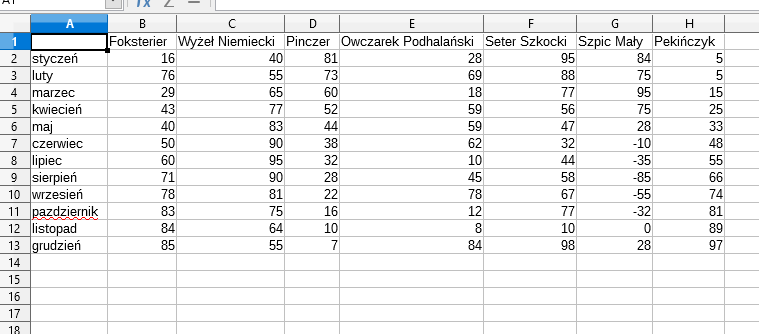

# Raport -generator wykresów i analiza danych
<h4>Wczytanie danych</h4> 
Aplikacja generuje wykresy w przeglądarce internetowej stworzone na podstawie danych zawartych w pliku formatu *.csv. Plik ten może być wcześniej utworzony za pomocą aplikacji Google Spreadsheets lub innego programu do tworzenia tabel, który potrafi utworzyć plik formatu *.csv.  Separatorem w takim pliku jest przecinek. Kilka przykładowych plików zapisanych w *.csv użytych do testowania aplikacji znajduje się w repozytorium w katalogu Raport/read-test/ . Tak utworzony plik można wczytać do aplikacji przez przycisk, lub przez upuszczenie ikony pliku na odpowiednie pole w aplikacji.  
<h4>Model danych</h4>
W pierwszym wierszu pliku znajdują się nazwy poszczególnych sierii danych, w pierwszej kolumnie znajdują sie wspólne argumenty dla wszystkich serii danych które będą na osi X, w pozostałych komórkach są wartości dla poszczególnych serii danych. Jedna kolumna to jedna seria danych.  Przykładowa tabela z danymi do aplikacji jest poniżej. 
 
<h4>Działanie aplikacji</h4>
Dane z pliku ukazują się w aplikacji, a następnie mogą być przez użytkownika analizowane takimi narzędziami jak sortownie, czy filtrowanie. W następnym etapie zostaje stworzony wykres. Aplikacja ma możliwość generowania 6 typów wykresów (liniowy, słupkowy, kolumnowy, pierścieniowy, kołowy, polarny) w różnych wariantach. Dla każdego wariantu można wybrać różnego rodzaju opcje. Np. dla liniowego mozna zmienić kolory linii, zmienić skalę osi Y na logarytmiczną, można zakreślić pole pod linia, wpisać dowolny tytuł. Na końcu wykres wraz z danymi po przeanalizowaniu może być skomentowany przez użytkownika, a potem wydrukowany wraz z komentarzem i tabelą danych lub bez. 
<h4>Technologie zastosowane w aplikacji</h4>
W budowie aplikacji zastosowano biblioteki takie jak jQuery, Bootstrap 4, bibliotekę do robienia wykresów: Chart.js
